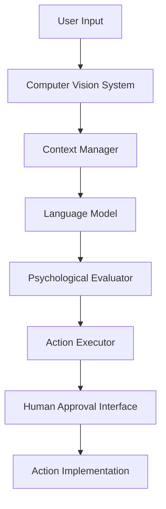

# SQUID Technical Specification

## 1. System Architecture Overview

### 1.1 Core Components
- Computer Vision System (based on Molmo)
- Language Model Interface
- Virtual Context Management System (inspired by MemGPT)
- Psychological Evaluation Framework
- Social Media Management System
- Human Approval Interface

### 1.2 Component Interaction Flow


## 2. Virtual Context Management System

### 2.1 Memory Hierarchy
- Active Context (RAM-equivalent)
- Recent Context Cache (SSD-equivalent)
- Long-term Storage (Database)

### 2.2 Context Types
- Screen State Context
- User Preference Context
- Social Media Context
- Interaction History
- Psychological Profile Data

### 2.3 Memory Management
```python
class ContextManager:
    def __init__(self):
        self.active_context = ActiveContextWindow()
        self.recent_cache = RecentContextCache()
        self.long_term_storage = LongTermStorage()

    async def update_context(self, new_data):
        # Evaluate importance using psychological framework
        importance = await self.evaluate_importance(new_data)

        if importance > IMMEDIATE_THRESHOLD:
            self.active_context.update(new_data)
        elif importance > CACHE_THRESHOLD:
            self.recent_cache.store(new_data)
        else:
            self.long_term_storage.archive(new_data)
```

## 3. Psychological Evaluation Framework

### 3.1 Evaluation Dimensions
- Content Relevance
- User Interest Alignment
- Emotional Impact
- Social Value
- Information Quality
- Engagement Potential

### 3.2 Evaluation Implementation
```python
class PsychologicalEvaluator:
    def __init__(self):
        self.user_profile = UserPsychologicalProfile()
        self.content_analyzer = ContentAnalysisSystem()

    async def evaluate_content(self, content):
        relevance = await self.analyze_relevance(content)
        emotional_impact = await self.analyze_emotional_impact(content)
        social_value = await self.analyze_social_value(content)

        return ContentEvaluation(
            score=self.compute_composite_score(
                relevance, emotional_impact, social_value
            ),
            recommendations=self.generate_recommendations()
        )
```

## 4. Social Media Management System

### 4.1 Content Processing Pipeline
1. Content Ingestion
2. Psychological Evaluation
3. Relevance Assessment
4. Summarization
5. Human Approval Queue
6. Action Implementation

### 4.2 Implementation
```python
class SocialMediaManager:
    def __init__(self):
        self.content_processor = ContentProcessor()
        self.psych_evaluator = PsychologicalEvaluator()
        self.approval_queue = HumanApprovalQueue()

    async def process_feed(self, feed_content):
        processed_items = []
        for item in feed_content:
            evaluation = await self.psych_evaluator.evaluate_content(item)
            if evaluation.score > RELEVANCE_THRESHOLD:
                summary = await self.content_processor.summarize(item)
                processed_items.append(
                    ProcessedContent(
                        content=item,
                        summary=summary,
                        evaluation=evaluation
                    )
                )
        return processed_items
```

## 5. Computer Vision Integration

### 5.1 Screen Analysis System
```python
class ScreenAnalyzer:
    def __init__(self):
        self.vision_model = VisionModel()
        self.element_detector = UIElementDetector()

    async def analyze_screen(self, screenshot):
        elements = await self.element_detector.detect(screenshot)
        context = await self.vision_model.extract_context(screenshot)
        return ScreenState(
            elements=elements,
            context=context,
            timestamp=datetime.now()
        )
```

### 5.2 Action Implementation
```python
class ActionExecutor:
    def __init__(self):
        self.screen_analyzer = ScreenAnalyzer()
        self.context_manager = ContextManager()

    async def execute_action(self, action_plan):
        current_state = await self.screen_analyzer.analyze_screen()
        context = await self.context_manager.get_relevant_context(
            current_state
        )

        return await self.implement_action(
            action_plan, current_state, context
        )
```

## 6. Human Approval Interface

### 6.1 Approval Queue Management
```python
class ApprovalQueue:
    def __init__(self):
        self.pending_actions = PriorityQueue()
        self.approved_actions = Queue()
        self.rejected_actions = Queue()

    async def add_action(self, action, priority):
        await self.pending_actions.put(
            PrioritizedAction(action, priority)
        )

    async def get_next_action(self):
        return await self.pending_actions.get()
```

### 6.2 Action Implementation
```python
class ActionImplementer:
    def __init__(self):
        self.approval_queue = ApprovalQueue()
        self.executor = ActionExecutor()

    async def process_approved_actions(self):
        while True:
            action = await self.approval_queue.get_next_approved()
            await self.executor.execute_action(action)
```

## 7. Data Flow and Integration

### 7.1 System Integration
```python
class SQUID:
    def __init__(self):
        self.context_manager = ContextManager()
        self.psych_evaluator = PsychologicalEvaluator()
        self.social_media_manager = SocialMediaManager()
        self.screen_analyzer = ScreenAnalyzer()
        self.action_implementer = ActionImplementer()

    async def process_input(self, user_input):
        # Analyze current screen state
        screen_state = await self.screen_analyzer.analyze_screen()

        # Update context with new input
        await self.context_manager.update_context({
            'user_input': user_input,
            'screen_state': screen_state
        })

        # Generate and evaluate action plan
        action_plan = await self.generate_action_plan(
            user_input, screen_state
        )
        evaluation = await self.psych_evaluator.evaluate_action(
            action_plan
        )

        # Queue for approval if necessary
        if evaluation.requires_approval:
            await self.action_implementer.approval_queue.add_action(
                action_plan,
                evaluation.priority
            )
        else:
            await self.action_implementer.execute_action(action_plan)
```

### 7.2 Error Handling and Recovery
```python
class ErrorHandler:
    def __init__(self):
        self.error_logger = ErrorLogger()
        self.recovery_strategies = RecoveryStrategies()

    async def handle_error(self, error, context):
        await self.error_logger.log(error, context)
        strategy = await self.recovery_strategies.get_strategy(error)
        return await strategy.execute(context)
```

## 8. Security and Privacy

### 8.1 Data Protection
- End-to-end encryption for user data
- Secure storage of psychological profiles
- Access control for human approval interface

### 8.2 Implementation
```python
class SecurityManager:
    def __init__(self):
        self.encryption = EncryptionSystem()
        self.access_control = AccessControl()

    async def secure_data(self, data):
        encrypted = await self.encryption.encrypt(data)
        return await self.access_control.protect(encrypted)
```

## 9. Deployment and Scaling

### 9.1 Component Deployment
- Containerized microservices
- Load balancing for multiple users
- Distributed context storage

### 9.2 Implementation
```python
class DeploymentManager:
    def __init__(self):
        self.container_manager = ContainerManager()
        self.load_balancer = LoadBalancer()
        self.scaling_manager = ScalingManager()

    async def deploy_component(self, component):
        container = await self.container_manager.create(component)
        await self.load_balancer.register(container)
        return container
```

## 10. Testing and Validation

### 10.1 Test Framework
```python
class TestFramework:
    def __init__(self):
        self.unit_tester = UnitTester()
        self.integration_tester = IntegrationTester()
        self.psychological_validator = PsychologicalValidator()

    async def run_tests(self):
        await self.unit_tester.run()
        await self.integration_tester.run()
        await self.psychological_validator.validate()
```

### 10.2 Validation Metrics
- Response accuracy
- Context retention
- Psychological evaluation accuracy
- User satisfaction
- System performance

## 11. Future Extensions

### 11.1 Planned Features
- Advanced emotion recognition
- Multi-user context sharing
- Automated learning from user feedback
- Enhanced privacy controls

### 11.2 Research Areas
- Improved psychological models
- Advanced context compression
- Enhanced security measures
- Performance optimization
